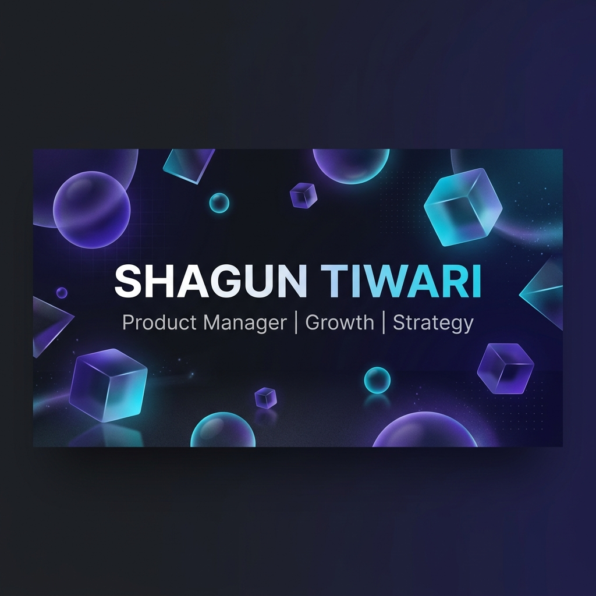

# Shagun Tiwari | Product Manager Portfolio

<div align="center">
  
  <br />
  <p align="center">
    <strong>Building products with clarity, empathy, and measurable impact.</strong>
  </p>
  <p align="center">
    <a href="https://shaguntiwari.vercel.app/">Live Demo</a> •
    <a href="https://www.linkedin.com/in/shagun06">LinkedIn</a> •
    <a href="https://medium.com/@shaguntiwari0611">Medium</a> •
    <a href="https://shaguntiwari.vercel.app/resume.pdf">Resume</a>
  </p>
</div>

---

## Overview

This is the official portfolio of **Shagun Tiwari**, a Product Manager specializing in Product Strategy, Growth, and B2B SaaS. The platform is designed to showcase high-impact case studies, professional experience, and a deep focus on user-centered design and data-driven decision-making.

The project is built with a **premium, glassmorphic aesthetic**, focusing on visual excellence, smooth interactions, and a seamless user experience across all devices.

## Tech Stack

### Core
- **Framework**: [Next.js 16 (App Router)](https://nextjs.org/)
- **Library**: [React 19](https://react.dev/)
- **Language**: [TypeScript](https://www.typescriptlang.org/)
- **Package Manager**: [Bun](https://bun.sh/)

### Styling & Animations
- **CSS Framework**: [Tailwind CSS v4](https://tailwindcss.com/)
- **Animations**: [GSAP](https://greensock.com/gsap/) & [Framer Motion](https://www.framer.com/motion/)
- **Smooth Scroll**: [Lenis](https://github.com/darkroomengineering/lenis)
- **Icons**: [Lucide React](https://lucide.dev/)

### 3D & Graphics
- **Engine**: [Three.js](https://threejs.org/)
- **React Adapter**: [React Three Fiber](https://docs.pmnd.rs/react-three-fiber)
- **Utilities**: [Drei](https://github.com/pmndrs/drei)

### Backend & Services
- **Email Service**: [Resend](https://resend.com/)
- **Notifications**: [Sonner](https://sonner.stevenlu.com/)
- **Analytics**: [Vercel Analytics](https://vercel.com/analytics)

---

## Key Features

- **Glassmorphic UI**: A premium design system using semi-transparent layers and vibrant gradients.
- **Magnetic Interactions**: GSAP-powered magnetic effects on buttons and interactive elements.
- **Smooth Scrolling**: Seamless, momentum-based scrolling powered by Lenis for a luxury feel.
- **Dynamic Case Studies**: Deep dives into projects like **CloudHire**, **Dice**, and **EnKash** with detailed outcomes.
- **Fully Responsive**: Optimized for every screen size, from mobile devices to ultra-wide monitors.
- **Interactive Contact Form**: A functional, validated contact form integrated with **Resend** for real-time inquiries.
- **SEO Optimized**: High-performance architecture with automated Sitemap, Robots.txt, and JSON-LD schema.

---

## Project Structure

```bash
├── public/               # Static assets (images, icons, resume)
├── src/
│   ├── app/              # Next.js App Router (pages & layouts)
│   ├── components/
│   │   ├── sections/     # Modular page sections (Hero, Projects, Contact)
│   │   └── ui/           # Reusable UI components (Buttons, Cards, Cursor)
│   ├── content/          # Main data source (Project info, Bio, Experience)
│   ├── hooks/            # Custom React hooks (useLenis, useGSAP)
│   ├── types/            # TypeScript interfaces & definitions
│   └── utils/            # Helper functions and animation logic
├── tailwind.config.ts    # Styling configuration
└── package.json          # Project dependencies & scripts
```

---

## Getting Started

### Prerequisites
- [Node.js](https://nodejs.org/) (v18+) or [Bun](https://bun.sh/)
- A [Resend](https://resend.com/) API key for the contact form

### Installation

1. **Clone the repository:**
   ```bash
   git clone https://github.com/your-username/shaguntiwari-portfolio.git
   cd shaguntiwari-portfolio
   ```

2. **Install dependencies:**
   ```bash
   bun install
   # or
   npm install
   ```

3. **Set up Environment Variables:**
   Create a `.env.local` file in the root directory and add your Resend API Key:
   ```env
   RESEND_API_KEY=your_resend_api_key_here
   ```

4. **Run the development server:**
   ```bash
   bun dev
   # or
   npm run dev
   ```

5. **Build for production:**
   ```bash
   bun run build
   ```

---

## Performance & SEO

This portfolio is engineered for speed and search engine visibility:
- **Static Site Generation (SSG)**: Pre-rendered pages for ultra-fast load times.
- **Image Optimization**: Automatic image resizing and WebP conversion via `next/image`.
- **Accessibility (A11y)**: Proper semantic HTML, ARIA labels, and keyboard navigation.
- **Metadata**: Comprehensive Open Graph (OG) tags for professional social sharing.

---

## Contact

Feel free to reach out for collaborations or opportunities!

- **Email**: [shaguntiwari0611@gmail.com](mailto:shaguntiwari0611@gmail.com)
- **LinkedIn**: [shagun06](https://www.linkedin.com/in/shagun06)
- **Portfolio**: [shaguntiwari.vercel.app](https://shaguntiwari.vercel.app/)

---

<p align="center">
  Developed by Shagun Tiwari
</p>
